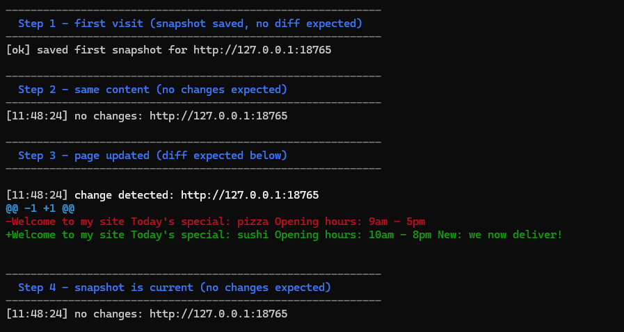

# web-watcher

> Monitor any website for changes. Get instant terminal diffs — and optional email alerts — whenever a page updates.

[](https://www.python.org/)
[](LICENSE)
[](https://github.com/donny711/web-watcher)

## Demo



## Why web-watcher?

- No account, no SaaS, no browser extension — just a Python script
- Shows exactly **what changed** with colored diffs (red = removed, green = added)
- Watch multiple URLs simultaneously at custom intervals
- Get notified by email (Gmail) when something changes
- Snapshots persist across runs — picks up where it left off

## Requirements

- Python 3.9+
- pip

## Installation

```bash
git clone https://github.com/donny711/web-watcher.git
cd web-watcher
pip install -r requirements.txt
```

## Usage

Watch a single URL (default: every 5 minutes):
```bash
python3 watcher.py https://example.com
```

Watch multiple URLs every 30 seconds:
```bash
python3 watcher.py https://example.com https://news.ycombinator.com -i 30s
```

One-shot check and exit:
```bash
python3 watcher.py https://example.com --once
```

## Interval Format

| Flag | Meaning |
|------|---------|
| `-i 30s` | 30 seconds |
| `-i 5m` | 5 minutes |
| `-i 2h` | 2 hours |
| `-i 60` | 60 seconds (raw int) |

## Snapshots

Stored in `snapshots/` by default (one `.txt` file per URL). Change the location:
```bash
python3 watcher.py https://example.com --snapshots-dir /tmp/my-snapshots
```

## Email Notifications (Gmail)

1. Enable 2-Factor Authentication on your Google account
2. Generate an **App Password** at https://myaccount.google.com/apppasswords
3. Run with:
```bash
python3 watcher.py https://example.com \
  --email-from you@gmail.com \
  --email-to recipient@example.com \
  --email-password "your-16-char-app-password"
```

## Run Tests

```bash
python3 -m pytest -v
```

## Project Structure

```
web-watcher/
├── watcher.py          # CLI entry point + main loop
├── fetcher.py          # HTTP download + HTML text extraction
├── differ.py           # Colored diff computation
├── notifier.py         # Terminal + email notifications
├── snapshots/          # Auto-created; stores per-URL snapshots
├── tests/
│   ├── test_fetcher.py
│   ├── test_differ.py
│   ├── test_notifier.py
│   └── test_watcher.py
└── requirements.txt
```

## License

[MIT](LICENSE)
